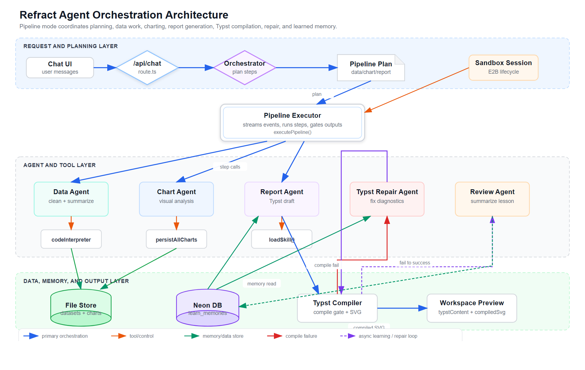

# Refract - 24/7 Agent Helper

<p align="center">
<a href="./README.md">English</a> | <a href="./README-ZH.md">中文</a>
</p>

<p align="center">
  
</p>

<p align="center">
<a href="https://opensource.org/licenses/MIT"></a>
</p>

<p align="center">
  <a href="https://vercel.com/new/clone?repository-url=https://github.com/Waterkyuu/refract&env=ZHIPU_API_KEY,E2B_API_KEY,PUBLIC_NEON_AUTH_URL,NEON_DATA_PUBLIC_API_URL,CLOUDFLARE_ACCOUNT_ID,R2_ACCESS_KEY_ID,R2_SECRET_ACCESS_KEY&envDescription=API%20keys%20and%20service%20credentials%20required%20by%20Fire%20Wave%20Agent&project-name=refract&repository-name=refract"></a>
  <a href="https://railway.com/new/template?templateUrl=https://github.com/Waterkyuu/refract"></a>
  <a href="https://zeabur.com/templates/new?repoUrl=https://github.com/Waterkyuu/refract"></a>
</p>

多智能体编排支持数据分析和简历生成，其他功能正在开发中。目标是创建 24/7 全天候工作的智能 Agent。

## 快速开始

### 环境要求

- Node.js 20+
- pnpm 9+

### 安装

```bash
git clone https://github.com/Waterkyuu/refract.git
cd refract
pnpm install
```

### 环境变量

在根目录创建 `.env.local` 文件：

```env
# 智谱 AI（必填）
ZHIPU_API_KEY=your_zhipu_api_key

# E2B 沙盒（必填）
E2B_API_KEY=your_e2b_api_key

# 模型（可选，默认 glm-4-flash）
GLM_MODLE=glm-4-flash

# Neon Auth（认证功能必填）
NEON_AUTH_BASE_URL=your_neon_auth_url
NEON_AUTH_COOKIE_SECRET=your_cookie_secret

# Cloudflare R2（文件上传功能必填）
CLOUDFLARE_ACCOUNT_ID=your_account_id
R2_ACCESS_KEY_ID=your_access_key
R2_SECRET_ACCESS_KEY=your_secret_key

NPM_REGISTRY = "https://registry.npmmirror.com"
```

### 开发

```bash
pnpm dev
```

打开 [http://localhost:3000](http://localhost:3000) 查看应用。

### 构建

```bash
pnpm build
pnpm start
```

### Docker

使用 Docker Compose 构建并运行：

```bash
docker compose up -d --build
```

如果环境变量保存在本地文件中，可以在启动 Compose 时传入：

```bash
docker compose --env-file .env.local up -d --build
```

或直接构建并运行镜像：

```bash
docker build -t fire-wave-agent .
docker run -d -p 3000:3000 --env-file .env.local --name fire-wave-agent fire-wave-agent
```

### Vercel 上的认证

如果认证在本地正常工作，但在部署的 Vercel 域名上失败并出现类似 `{"code":"INVALID_ORIGIN","message":"Invalid origin"}` 的错误，说明你的 Neon Auth 项目拒绝了该站点来源。

将所有已部署的应用来源添加到 Neon Auth / Better Auth 的受信任来源配置中，例如：

```txt
http://localhost:3000
https://fire-wave-agent.vercel.app
```

还应确保在使用的任何 OAuth 提供商的回调或重定向设置中，允许相同的生产域名。

## 常用命令

| 命令 | 说明 |
|------|------|
| `pnpm dev` | 启动开发服务器（Turbopack） |
| `pnpm build` | 生产环境构建 |
| `pnpm start` | 启动生产服务器 |
| `pnpm check:write` | 代码检查与格式化 |
| `pnpm test` | 运行单元测试 |
| `pnpm test:e2e` | 运行端到端测试 |

## 架构



## 许可证

MIT
