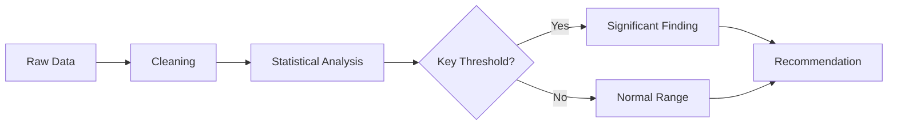

# Markdown Report Skill

This skill provides a professional analysis report template with rich Markdown formatting.

## Rule
1. Unless requested by the user, adding any emojis is strictly prohibited.
2. All chart image references MUST use the workspace download URL format: ``.
3. Use the `markdown-author` skill patterns for advanced visual elements (badges, cards, timelines, callouts, etc.).

---

## Report Template

```md
# {Report Title}

> **Author:** {Agent Name} | **Date:** {YYYY-MM-DD} | **Status:** <span style="display: inline-block; background-color: #22c55e; color: white; font-size: 0.75em; font-weight: 600; padding: 2px 8px; border-radius: 9999px; vertical-align: middle;">Final</span>

---

## Executive Summary

{2-3 sentence overview of the key findings and recommendations.}

---

## 1. Data Overview

### 1.1 Data Source

| Item | Detail |
|------|--------|
| Source | {file name or description} |
| Records | {rowCount} rows |
| Columns | {columnCount} columns |
| Time Range | {start} - {end} |
| Data Quality | {percentage}% complete |

### 1.2 Data Cleaning Summary

{Brief description of cleaning steps performed.}

| Step | Action | Records Affected |
|------|--------|-----------------|
| 1 | Removed duplicates | {n} |
| 2 | Filled missing values | {n} |
| 3 | Type corrections | {n} |
| 4 | Outlier treatment | {n} |

---

## 2. Key Findings

### 2.1 {Finding Category 1}

{Description with specific numbers.}

| Metric | Value | Change |
|--------|-------|--------|
| {metric 1} | {value} | {+/-%} |
| {metric 2} | {value} | {+/-%} |
| {metric 3} | {value} | {+/-%} |

### 2.2 {Finding Category 2}

{Description with specific numbers.}

---

## 3. Data Visualizations

### 3.1 {Chart 1 Title}


*Figure 1: {Chart 1 caption explaining what the chart shows and the key insight.}*

### 3.2 {Chart 2 Title}


*Figure 2: {Chart 2 caption explaining what the chart shows and the key insight.}*

### 3.3 Analysis Flowchart

When the analysis involves a decision process, use a Mermaid flowchart:



---

## 4. Statistical Summary

| Statistic | {Column 1} | {Column 2} | {Column 3} |
|-----------|-----------|-----------|-----------|
| Mean | {val} | {val} | {val} |
| Median | {val} | {val} | {val} |
| Std Dev | {val} | {val} | {val} |
| Min | {val} | {val} | {val} |
| Max | {val} | {val} | {val} |

---

## 5. Conclusions

> [!IMPORTANT]
> {Most critical finding that the reader must not miss.}

1. **{Conclusion 1}:** {Evidence-based statement with specific numbers.}
2. **{Conclusion 2}:** {Evidence-based statement with specific numbers.}
3. **{Conclusion 3}:** {Evidence-based statement with specific numbers.}

---

## 6. Recommendations

| Priority | Recommendation | Expected Impact | Effort |
|----------|---------------|----------------|--------|
| High | {action 1} | {impact} | {effort} |
| Medium | {action 2} | {impact} | {effort} |
| Low | {action 3} | {impact} | {effort} |

---

## Appendix

### Methodology

{Brief description of analytical methods used.}

### Limitations

- {Limitation 1}
- {Limitation 2}
```

---

## Image URL Rules

When referencing chart images in the report:

1. Use the persisted chart artifact URL format:
   ```
   
   ```

2. Replace `{fileId}` with the actual file ID from `persistAllCharts` or `persistCodeFile` tool output.

3. Always include a figure caption below the image using italics:
   ```
   *Figure N: Description of what the chart shows.*
   ```

## Mermaid Diagram Rules

Use Mermaid diagrams when the report needs:

- Process flows: `graph TD` or `graph LR`
- Decision trees: `graph TD` with diamond `{} ` nodes
- Timelines: `graph LR` with sequential nodes
- Data pipelines: `graph LR` showing transformation steps

Keep diagrams simple. Maximum 10 nodes per diagram for readability.
```
